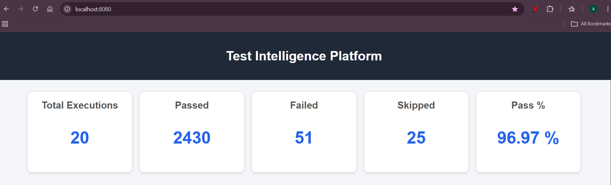
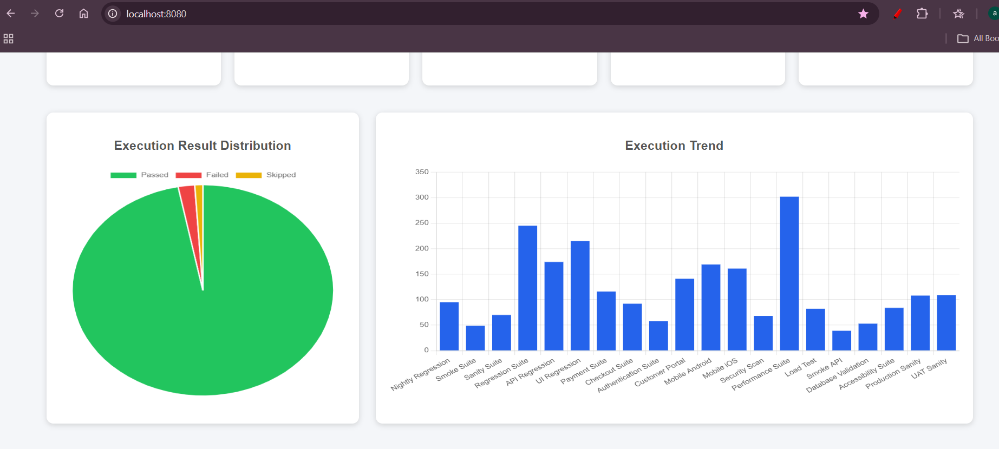
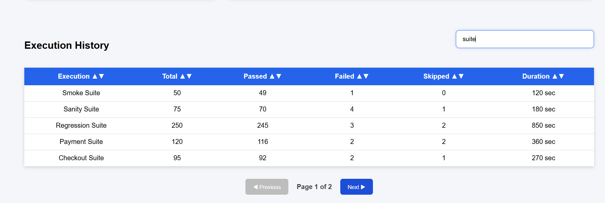

# 🚀 Test Intelligence Platform

A full-stack **Test Intelligence Dashboard** built with **Java, Spring Boot, REST APIs, PostgreSQL, HTML, CSS, JavaScript, and Chart.js** to visualize automated test execution analytics.

The project simulates how QA teams can capture automated test execution results, monitor regression trends, and visualize quality metrics through a centralized dashboard.

---

## 🎯 Project Overview

The Test Intelligence Platform provides a simple dashboard for storing and analyzing automated test execution results.

Test execution data is submitted through REST APIs and persisted in PostgreSQL. The application then calculates and displays execution summaries and analytics through a browser-based dashboard.

### High-Level Flow

```text
Automated Test Execution
          │
          ▼
     REST API
          │
          ▼
    Spring Boot
          │
     ┌────┴────┐
     ▼         ▼
 Service     Repository
     │         │
     └────┬────┘
          ▼
      PostgreSQL
          │
          ▼
   Dashboard / Charts
```

---

# 📷 Application Preview

## Dashboard Overview

<p align="center">

</p>

---

## Test Analytics

<p align="center">

</p>

---

## Execution History

<p align="center">

</p>

---

# ✨ Features

## 📊 Dashboard

The dashboard provides a summary of automated test execution results:

- Total executions
- Total passed tests
- Total failed tests
- Total skipped tests
- Overall pass percentage

---

## 📈 Test Analytics

The dashboard provides visual analytics using Chart.js:

- Passed vs Failed vs Skipped distribution
- Test execution trends
- Execution summary visualization

---

## 📋 Execution History

The execution history provides:

- Execution search
- Column sorting
- Pagination
- Responsive data table
- Test execution details

---

# 🔌 REST APIs

The application exposes REST APIs for managing test execution data.

| Method | Endpoint | Description |
|--------|----------|-------------|
| `POST` | `/api/executions` | Save a test execution |
| `GET` | `/api/executions` | Retrieve all test executions |
| `GET` | `/api/executions/summary` | Retrieve dashboard summary |

---

# 🛠️ Technology Stack

## Backend

- Java 21
- Spring Boot
- Spring Web
- Spring Data JPA
- Hibernate
- Maven
- Lombok

## Database

- PostgreSQL

## Frontend

- HTML5
- CSS3
- JavaScript
- Chart.js

## Tools

- Postman
- Eclipse / Spring Tool Suite
- Git
- GitHub

---

# 🏗️ Application Architecture

The application follows a layered Spring Boot architecture.

```text
Controller
    │
    ▼
Service
    │
    ▼
Repository
    │
    ▼
PostgreSQL
```

### Controller Layer

Handles incoming REST API requests and delegates business operations to the service layer.

### Service Layer

Contains the application/business logic used to process test execution data and generate dashboard summaries.

### Repository Layer

Uses Spring Data JPA to communicate with PostgreSQL.

### DTO Layer

Uses DTOs to represent dashboard summary information returned by the API.

---

# 📂 Project Structure

```text
test-intelligence-platform/
│
├── .mvn/
│   └── wrapper/
│
├── screenshots/
│   ├── dashboard.png
│   ├── charts.png
│   └── history.png
│
├── src/
│   └── main/
│       ├── java/
│       │   └── com/
│       │       └── ashok/
│       │           └── tip/
│       │               ├── controller/
│       │               │   └── DashboardController.java
│       │               ├── service/
│       │               │   └── DashboardService.java
│       │               ├── repository/
│       │               │   └── TestExecutionRepository.java
│       │               ├── model/
│       │               │   └── TestExecution.java
│       │               └── dto/
│       │                   └── DashboardSummaryDTO.java
│       │
│       └── resources/
│           ├── static/
│           │   ├── index.html
│           │   └── style.css
│           └── application.properties
│
├── .gitattributes
├── .gitignore
├── mvnw
├── mvnw.cmd
├── pom.xml
└── README.md
```

---

# 📈 Dashboard Capabilities

The current dashboard supports:

- ✅ Dashboard summary
- ✅ Test execution analytics
- ✅ Execution trends
- ✅ Search executions
- ✅ Sort table columns
- ✅ Pagination
- ✅ Responsive dashboard
- ✅ REST API integration
- ✅ PostgreSQL persistence

---

# 🚀 Getting Started

## Prerequisites

Make sure the following are installed:

- Java 21
- Maven
- PostgreSQL
- Git

Verify Java:

```bash
java -version
```

Verify Maven:

```bash
mvn -version
```

---

# 📥 Clone Repository

```bash
git clone https://github.com/ashokadi34/test-intelligence-platform.git
```

Navigate to the project:

```bash
cd test-intelligence-platform
```

---

# 🗄️ Configure PostgreSQL

Create a PostgreSQL database:

```sql
CREATE DATABASE tipdb;
```

The application is configured to use:

```text
Host: localhost
Port: 5432
Database: tipdb
```

Update the database username and password in:

```text
src/main/resources/application.properties
```

Example configuration:

```properties
spring.datasource.url=jdbc:postgresql://localhost:5432/tipdb
spring.datasource.username=YOUR_USERNAME
spring.datasource.password=YOUR_PASSWORD

spring.datasource.driver-class-name=org.postgresql.Driver

spring.jpa.hibernate.ddl-auto=update
spring.jpa.show-sql=true
spring.jpa.properties.hibernate.format_sql=true

server.port=8080
```

> **Security:** Do not commit real database credentials to GitHub. Use local configuration or environment variables for credentials.

---

# ▶️ Run the Application (in your local)

Using Maven:

```bash
mvn spring-boot:run
```

Or on Windows:

```bash
mvnw.cmd spring-boot:run
```

The application starts at:

```text
http://localhost:8080
```

Open the application in a browser:

```text
http://localhost:8080
```

---

# 📮 REST API Examples

## 1. Save Test Execution

### Request

```http
POST /api/executions
Content-Type: application/json
```

### Example Request Body

```json
{
  "executionName": "Regression Build 45",
  "totalTests": 520,
  "passedTests": 505,
  "failedTests": 10,
  "skippedTests": 5,
  "durationSeconds": 1480,
  "executionTime": "2026-06-25T21:30:00"
}
```

---

## 2. Get All Executions

```http
GET /api/executions
```

Returns the stored test execution records.

---

## 3. Get Dashboard Summary

```http
GET /api/executions/summary
```

Returns summary information including:

```text
Total Executions
Total Passed Tests
Total Failed Tests
Total Skipped Tests
Pass Percentage
```

---

# 🧪 Example API Testing Flow

The APIs can be validated using Postman or any REST client.

```text
Create Test Execution
        ↓
POST /api/executions
        ↓
Persist Data
        ↓
PostgreSQL
        ↓
GET /api/executions
        ↓
GET /api/executions/summary
        ↓
Dashboard Analytics
```

---

# 🔍 Test Intelligence Use Case

The platform demonstrates how test execution results can be transformed into useful QA insights.

For example:

```text
Raw Test Results
      ↓
Execution Data
      ↓
Database
      ↓
Aggregation
      ↓
Pass / Fail / Skip Metrics
      ↓
Charts & Dashboard
```

This approach can be extended to integrate with automated regression pipelines and CI/CD systems.

---

# 🎯 SDET / QA Engineering Value

This project demonstrates practical experience in:

- REST API development
- API-driven test execution reporting
- Spring Boot
- Java 21
- Layered architecture
- Spring Data JPA
- Hibernate
- PostgreSQL integration
- DTO pattern
- Dashboard development
- Test execution analytics
- Chart.js visualization
- Search and sorting
- Pagination
- Git and GitHub

---

# 📚 Learning Outcomes

Through this project, I gained practical experience with:

- Building REST APIs using Spring Boot
- Designing layered application architecture
- Implementing service and repository layers
- Persisting test execution data using JPA/Hibernate
- Integrating PostgreSQL with Spring Boot
- Creating dashboard summary DTOs
- Building frontend analytics using Chart.js
- Implementing search, sorting and pagination
- Using Git and GitHub for version control

---

# 🔮 Future Enhancements

The following features can be added in future iterations:

- Authentication and authorization
- User management
- Execution status filtering
- Date-range filtering
- CSV export
- PDF export
- Dark mode
- Live dashboard refresh
- Jenkins integration
- Automated test result import
- Email reports
- Docker support
- CI/CD integration
- Cloud deployment

---

# 👨‍💻 Author

**Ashok Kumar**

Senior Software Test Engineer | SDET | QA Automation

Focused on:

- Java
- Playwright
- Selenium
- API Testing
- Test Automation
- CI/CD
- Quality Engineering

---

## ⭐ Repository

If you find this project useful, feel free to explore the implementation and provide feedback.

```text
https://github.com/ashokadi34/test-intelligence-platform
```
---

# Thank you!
